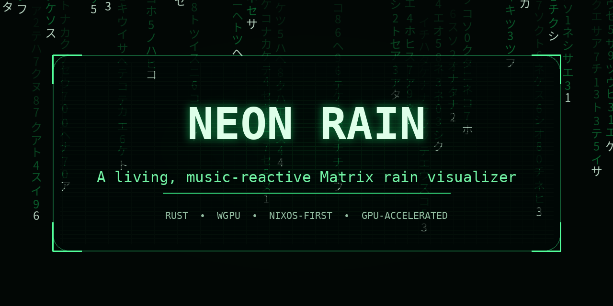

<p align="center">
  
</p>

<p align="center">
  <a href="https://github.com/Yearbook-enzyme/neon-rain/actions/workflows/ci.yml"></a>
  <a href="LICENSE"></a>
  
  
</p>

# Neon Rain

**Neon Rain is a GPU-accelerated Matrix rain visualizer that behaves more like a living audiovisual space than a screensaver.**

It combines a world-space glyph simulation, cinematic camera motion, bloom, music-responsive behavior, image-field coupling, and optional media enrichment in a native Rust + `wgpu` application.

> [!IMPORTANT]
> Neon Rain is currently an **early alpha**. The tested release target is `x86_64-linux` through a Nix flake. Broader Linux packaging and additional platforms are planned.

## What makes it different

- **Living rain simulation** — persistent streams, varied glyph behavior, depth, trails, and bloom.
- **Music-reactive direction** — PipeWire audio analysis and MPRIS player awareness influence pulse, density, motion, color, and cinematic timing.
- **World-space movement** — the camera can weave, drift, and move through the rain rather than presenting a fixed flat layer.
- **Image-field coupling** — local images can appear through, shape, or influence the rainfall.
- **Resilient enrichment** — lyrics, moodbars, metadata, and learned timelines are optional; the visualizer continues working when they are unavailable.
- **Inspectable behavior** — built-in help and signal-inspector overlays expose what the system is responding to.
- **Reproducible deployment** — the Nix package, development shell, tests, formatting, and Clippy checks are exercised in CI.

## Run it

### From this checkout

```bash
nix run .
```

Press `Escape` to exit.

### Public release command

Once the repository is public:

```bash
nix run github:Yearbook-enzyme/neon-rain
```

### Development shell

```bash
nix develop
cargo run --release
```

To launch with a local image collection:

```bash
cargo run --release -- --media-dir "/path/to/images"
```

## Current platform status

| Target | Status |
|---|---|
| NixOS / Nix, `x86_64-linux` | Tested alpha |
| Other Linux distributions | Packaging planned |
| Windows | Planned |
| macOS | Planned |
| Android / iOS | Exploratory |

The renderer uses `wgpu`, but platform support also depends on windowing, audio, media-player integration, helper tooling, packaging, and testing.

## Documentation

The original detailed project README—including controls, feature notes, and implementation-era reference material—has been preserved as [docs/REFERENCE.md](docs/REFERENCE.md).

- [Deployment notes](docs/DEPLOYMENT.md)
- [Contributing](CONTRIBUTING.md)
- [Changelog](CHANGELOG.md)
- [Security policy](SECURITY.md)

## Project status

The current alpha has passed:

- Rust formatting
- Rust unit tests
- Clippy
- Reproducible Nix package build
- GitHub Actions CI
- A fullscreen packaged smoke test on an AMD Radeon RX 580 using Vulkan

Real screenshots and demo video will replace the temporary generated banner as the public release gets closer.

## Roadmap

Near-term priorities are repository presentation, public alpha testing, clearer configuration, and broader Linux packaging. Later targets include Arch/AUR or Flatpak distribution, Debian/Ubuntu packaging, Windows and macOS builds, and experiments with mobile platforms.

The visual roadmap also includes richer themed modes, more deliberate movement through the rain space, and deeper image/video coupling.

## Contributing

Neon Rain is still changing quickly, so focused bug reports, reproducibility information, packaging work, documentation improvements, and small well-scoped pull requests are especially useful.

Read [CONTRIBUTING.md](CONTRIBUTING.md) before opening a pull request.

## License

Neon Rain is available under the [MIT License](LICENSE).

Copyright © 2026 Logan Campbell.
